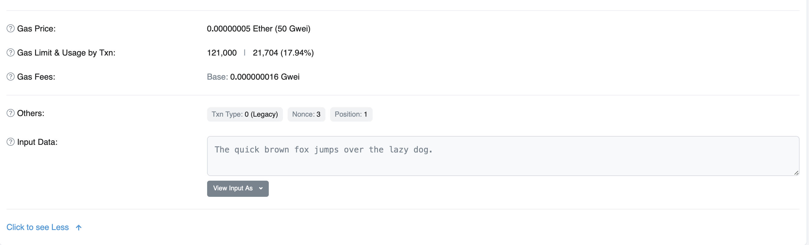

# Transactions


## Tasks

<aside>
✅ 1. Create, sign and send transaction with a text message in Ethereum Ropsten testnet.

</aside>

<aside>
✅ 2. Retrieve full transaction data.

</aside>

## Solution

1. Below Python code creates, signs and sends a transaction on Roptsten testnet with a text message in it:

```python
from web3 import Web3

infura_url='https://ropsten.infura.io/v3/3420f721c3d8404d8d7ce9dd6fec61d5'
web3 = Web3(Web3.HTTPProvider(infura_url))

account_from = Web3.toChecksumAddress('0xa2c1ab6c402f637a949f6d445eecc27ebea0f310')
private_key = '0xa05417f258f375c4e6cab48c88a35638ce4a6dfd404c893d79dfcd5889e9644c'
account_to = Web3.toChecksumAddress('0xf036001a51b15f3b62f9f141cde2681cbff6fa69')

# get the nonce.  Returns the number of transactions that have been sent from
# account as of the block specified by block_identifier.
# Prevents one from sending the transaction twice
nonce = web3.eth.getTransactionCount(account_from)

#The web3 interface offers a gasPrice suggestion, by calculating a median price across several blocks 
#gasLimit gives the maximum number of units of gas the transaction originator is willing to buy in order to complete the transaction. For simple payments, meaning transactions that transfer ether from one EOA to another EOA, the gas amount needed is fixed at 21,000 gas units
#gasPrice = web3.eth.getGasPrice(function(err, res) {console.log(res*21000)} )

# message we are going to send shall be converted to hex format
message = 'The quick brown fox jumps over the lazy dog.'

#form a transaction in a JSON format
tx = {
    'nonce': nonce,
    'to': account_to,
    'value': 0,
		'data': message.encode('utf-8'),
    'gas': 100000,
    'gasPrice': web3.toWei('50', 'gwei')	
}

#sign the transaction. Returns a transaction that’s been signed by the node’s private key, but not yet submitted.
signed_tx = web3.eth.account.sign_transaction(tx, private_key)

#send transaction. Sends a signed and serialized transaction. Returns the transaction hash as a HexBytes object
tx_hash = web3.eth.sendRawTransaction(signed_tx.rawTransaction)

#get transaction hash
print(web3.toHex(tx_hash))

#waits for the transaction specified by transaction hash to be included in a block
tx_receipt = web3.eth.waitForTransactionReceipt(tx_hash)
my_tx = web3.eth.getTransaction(tx_hash)
a=my_tx.input

#print 'Input' in hex format
print(a)

#decode Hex to string
string_value = bytes.fromhex(a[2:]).decode('utf-8')
print(string_value)
```

To inspect transaction use  `eth.getTransaction` or `eth.getTransactionReceipt` methods:


💡 The receipt is available only for mined transactions. But because of this, it includes a few more properties `status` , `gasUsed` , `cumulativeGasUsed` , `logs`


```python
from web3 import Web3

infura_url='https://ropsten.infura.io/v3/3420f721c3d8404d8d7ce9dd6fec61d5'
web3 = Web3(Web3.HTTPProvider(infura_url))

print(web3.eth.getTransaction('[0x13416255118b58674b5365395e0a5dd28ae2a0bb6e8b83e2b8202b2ac9840d63](https://ropsten.etherscan.io/tx/0x13416255118b58674b5365395e0a5dd28ae2a0bb6e8b83e2b8202b2ac9840d63)'))
```

You will get response like this:

```
AttributeDict(
{'blockHash': HexBytes('0xbb7dfe6a269482e8dcc538ebc4f23f99d0118580840622f0712bb4f7befc1c91'),
 'blockNumber': 11971228, 'from': '0xA2c1ab6C402f637a949f6d445eeCc27eBeA0F310',
 'gas': 121000, 'gasPrice': 50000000000,
 'hash': HexBytes('0x13416255118b58674b5365395e0a5dd28ae2a0bb6e8b83e2b8202b2ac9840d63'),
 'input': '0x54686520717569636b2062726f776e20666f78206a756d7073206f76657220746865206c617a7920646f672e',
 'nonce': 3, 'r': HexBytes('0xd9ef5de1e53852732c718d57738d72a8255edacf12abc9a3c27d8b41568e4023'),
 's': HexBytes('0x279f4a8f6cdf8748bab12dde8c582a5deaa48636c0036536ba245d924d96e7b0'),
 'to': '0xF036001A51B15F3b62f9F141Cde2681cbFf6Fa69',
 'transactionIndex': 1,
 'type': '0x0',
 'v': 28,
 'value': 0})
```

You may view this transaction in Etherscan:

[https://ropsten.etherscan.io/tx/0x13416255118b58674b5365395e0a5dd28ae2a0bb6e8b83e2b8202b2ac9840d63](https://ropsten.etherscan.io/tx/0x13416255118b58674b5365395e0a5dd28ae2a0bb6e8b83e2b8202b2ac9840d63)



