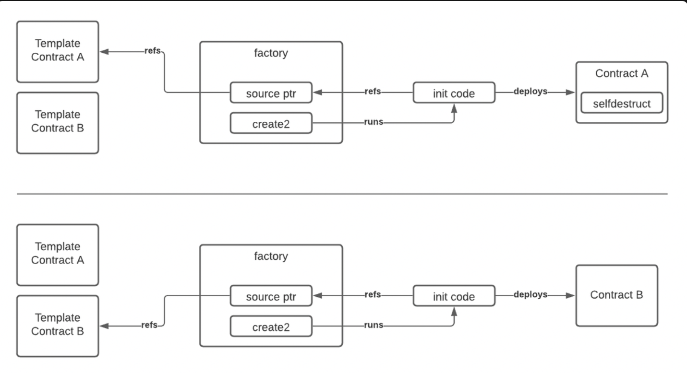

# OpCodes


## Tasks
<aside>
✅  1. Define all OpCodes responsible for smart contract creation and discuss their differences.

✅ 2. Write the OpCode stack to divide two numbers.

✅ 3. Explain why MEV bots use `SELFDESTRUCT`.

✅ 4. Write a smart contract proxy interface using `DELEGATECALL`. 

</aside>


## Task 1. Solution

**CREATE** opcode is used by default when deploying smart contracts. The deployed contract address is calculated like this:

```solidity
keccak256(senderAddress, nonce)
```

`nonce` is the number of contracts that have previously been deployed from that address

**CREATE2** opcode is introduced later and allows you to predetermine the contract address. Contract address is computed like this:

```solidity
keccak256(0xFF, senderAddress, salt, bytecode)
```

`0xFF` is a constant to prevent collision with CREATE opcode.

`salt` is a value sender sends when deploying contract.

`bytecode`  is the bytecode of the smart contract you want to deploy.

`CREATE2` has an important property that makes it preferable in certain situations: it doesn’t rely on the current state of the deploying address. This means you can be sure the contract address calculated today would be the same as the address calculated 1 year from now. This is important is because you can interact with the address, and send it ETH, before the smart contract has been deployed to it.

Example of contract deployment with CREAT2:

[https://github.com/miguelmota/solidity-create2-example](https://github.com/miguelmota/solidity-create2-example)

## Task 2. Solution

**Stack input**

1. `a`: integer numerator
2. `b`: integer denominator.

**Stack output**

1. `a // b`: integer result of the integer division. If the denominator is 0, the result will be 0.

```solidity
PUSH1 0x02
PUSH1 0x0a
DIV
```

Resulting stack is 0x05

## Task 3. Solution

Two low level operations, `CREATE2` and `SELFDESTRUCT`, allows to deploy a smart contract, self destruct, and redeploy to the exact same address. The `CREATE2` allows to deploy contracts at a predetermined address, but only if the address is empty, so first we need to `SELFDESTRUCT` (kill) the contract before re-creating it with the patched version.

With this we have the ability to patch and upgrade our contracts to rapidly iterate and fix vulnerabilities.

Why would you want to edit an existing smart contract rather than redeploy?

- If you already have a bunch of ERC-20 token balances, you can continue to benefit from the gas savings without having to reinitialize a bunch of storage slots
- If you’ve mined a leading 0 smart contract address, redeploying means having to remine a new leading 0 address. This way, you can redeploy to the exact same address without having to spend weeks waiting for a new one



## Task 4. Solution

Contract we are going to call function from:

```solidity
pragma solidity ^0.5.8;
contract Target {
    uint256 public calculateResult;
    address public user;
        
    function add(uint256 a, uint256 b) public returns (uint256) {
        calculateResult = a + b;

        user = msg.sender;
        
        return calculateResult;
    }
}
```

In Ethereum function call can be expressed by bytecode as long as 4 + 32 * N bytes. And this bytecode consists of two parts.

- **Function Selector**: This is first 4 bytes of function call’s bytecode. This is generated by hashing target function’s name plus with the type of its arguments excluding empty space.
- **Function Argument**: Convert each value of arguments into a hex string with the fixed length of 32bytes. If there is more than one argument, concatenate

If the user passes this 4 + 32 * N bytes bytecode to the data field of the transaction. EVM can find which function should be executed then inject arguments to that function.

Caller contract example:

```solidity
pragma solidity ^0.5.8;
import "./Target.sol";
contract Caller {
  
   uint256 public calculateResult;
   address public user;
   Storage public s;
    
    constructor(Storage addr) public {
       
        calculateResult = 0;
    }
        
    function addValuesWithDelegateCall(address calculator, uint256 a, uint256 b) public returns (uint256) {
        (bool success, bytes memory result) = calculator.delegatecall(abi.encodeWithSignature("add(uint256,uint256)", a, b));
        
        return abi.decode(result, (uint256));
    }
}
```